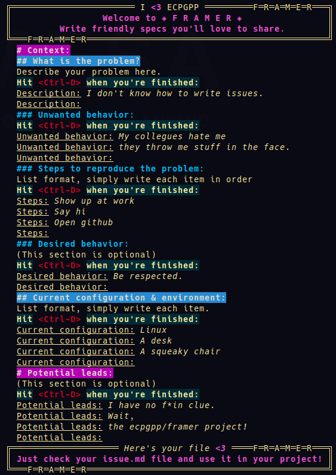
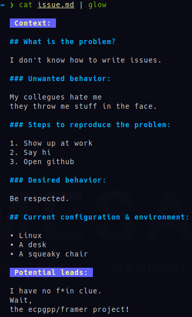

# Introduction

In this world, lots of problems occur due to poorly written issues. It's very often the lack of context or a badly described problem which leads to awful non efficient solution design, sometimes it can even lead to a complete loss of the initial subject. 
I mean, look at the global warming resulting of the decline of pirates. 
Anyway, how to write beautiful issues leading to faster and better understanding of the problem? Works with your team, or your future self

## What is the purpose of this project?

This document aims to be a pretty generic and easy to use template to write issues in any tech-related project. It is centered around a bug reporting starter, but can be modified to satisfy any case. This README provides explanations of the several sections meant to clarify what's your issue's about.

## How to use this project?

A virgin version will be available in this repository. You simply have to copy/paste this template as a skeletton to write your issues. This README is a manual to learn to use it, we provides exemple in *italic* for each sections.

### You currently have access to:
+ [A guide to fill a template of an issue to report problems](https://github.com/ECPGPP/framer/blob/main/problem-reporting-flavored-template-explained.md)
+ [An empty template of an issue to report problems](https://github.com/ECPGPP/framer/blob/main/problem-reporting-flavored-template-empty.md)

## Is it that good to apply this template? 
We have seen so often energy and time waisted just to grasp once more the once clear problem. Poorly written, methodless issues are the very root of poor handling capability of one's brain on one problem. This cause artificial increase in difficulty to solve the problem, meaning increase level of fatigue, inneficiency, delays, stress and so on. A well described problem is a well inited solution. Just test it for IT's sake.
Furthermore, issues or more specifically bug reportings are often unprecise, incomplete, non perfect. The better it's described, the less we have to guess the missing pieces.

## At the end of the day.
Well done, you succesfully written some beautiful issue! Your teammates will admire you and thank you for the bliss it is to work with someone so clear and profesionnal!

# Framer, a tool to help you writing your issues

## What is framer?

Based on the guidelines described above, Framer helps you to fill the different sections and then generate a clean markdown file in your folder. Framer is a pretty straightforward bash script which comes with minor disagreements.

## How to use it?
Simply execute the script wherever you want to, then check your freshly generated issue.md file, that's all!

## Minor disagreements:

+ When hitting `<Ctrl-D>` as you're done writing your line, **DO NOT FORGET TO HIT `<Enter>` FIRST**. You indeed need to go to the next line, otherwise your line will be lost.
+ You can not edit your inputs back, once you've hit `<Enter>` there's not turning back.

## Good news:
Framer is just a bash script generating a file, named issue.md. If an error was made during the typing process, you can correct it by hand while editing your said file with your favorite IDE/text editor (I guess it's neovim).

## Pro tips:
We recommand a markdown cli viewer like Glow to enjoy your md files directly in your terminal.
You would do so by typing :

```bash
cat issue.md | glow
```

[Glow github](https://github.com/charmbracelet/glow)

---





